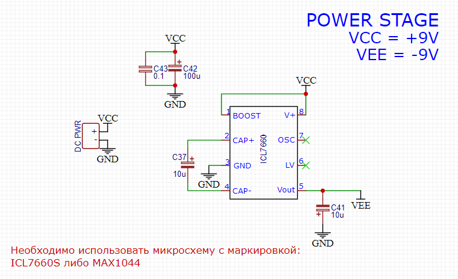
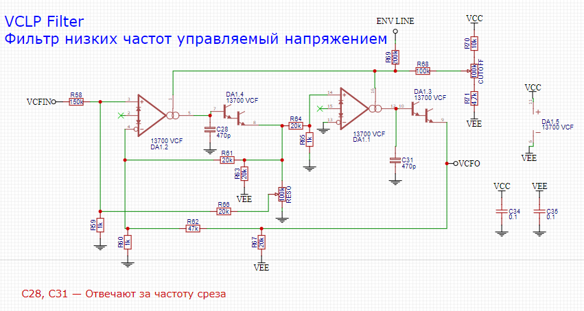

Как работает.

Педаль состоит из 6 условных блоков: 

По сути это часть аналогового синтезатора адаптированного под гитарный сигнал.

Конечно же здесь потребовалось двухполярное питание для полноценного управление фильтром, как и во многих педалях был использован преобразователь на переключающихся транзисторах для получения отрицательного напряжения **ICL7660**, он выдает до 20ma, чего вполне достаточно для питания всей схемы, а минимальное количество обвеса, то что нужно в условиях ограниченного размера. 

 
Входной каскад представляет из себя усилитель на двух ОУ с обратной связью. 
С выхода буфера сигнал пойдет сразу в три других блока: 
На вход чистого сигнала на микшере 
На вход перегрузаа 
На вход гейт конвертера 

 

Схема перегруза взята за основу Vertex TDrive, это достаточно гейновый овердрайв отдаленно напоминающий по схемотехнике ProCo RAT, но не такой злой, на выходе у него стоит JFET транзистор, добавляющий довольно приятной "теплоты". 
Питание этого блока была адаптированно под двухполярное напряжение, что по идеи должно было дать больший частотный диапазон, но по факту разница не ощущается.

Гейт конвертер использует 3 ОУ, двумя из которых усиливает сигнал в 100 раз, после чего полностью выпрямляет его компаратором.

Схема блока микшера была взята из MFOS SUB-COMMANDER из за удобного функционала и посыл/возврата сигнала, благодаря чему появилась возможность отправлять несколько сигналов в фильтр, микшируя на выходе их с чистым.

Энвелоп генератор взят из MFOS MINI SYNTH SOUND LAB, стабильная работа, широкий функционал для возможностей гитары и интересные артефакты при работе в AUDIO2GATE режиме не оставил других вариантов, на мой взгляд один из удачных AR|AD генераторов.

Пожалуй главный блок в схеме это фильтр низких частот управляемый напряжением. 
Это фильтр основанный на ОУ управляемым напряжением LM13700, давно ставший классическим при проектировании фильтром, компрессоров, лимитеров и друго аудио-оборудования. 
Мне потребовалось достаточно большое количество времени, чтоб сделать подходящий, приятно звучащий фильтр для гитары, так как большинсво схем разработаны с учетом "синтезаторного" сигнала и с гитарой звучат слишком резко.
