Для начала надо заказать платы, как это сделать напишу в отдельном разделе по ссылке:

Сборка очень простая и не должна вызвать каких либо сложностей, но на всякий случай сделал фото поэтапно: 
Собственно плата 
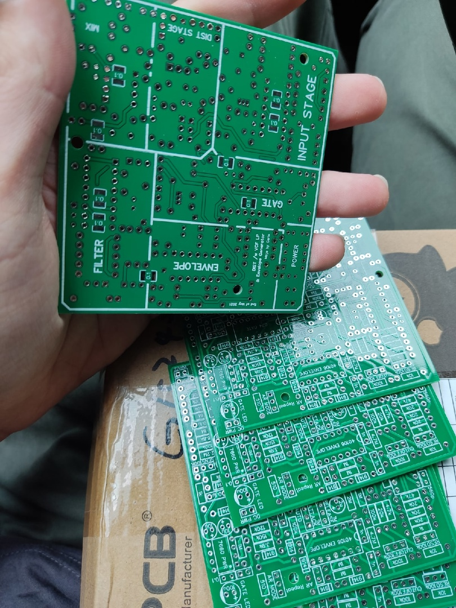

Устанавливаем все резисторы 
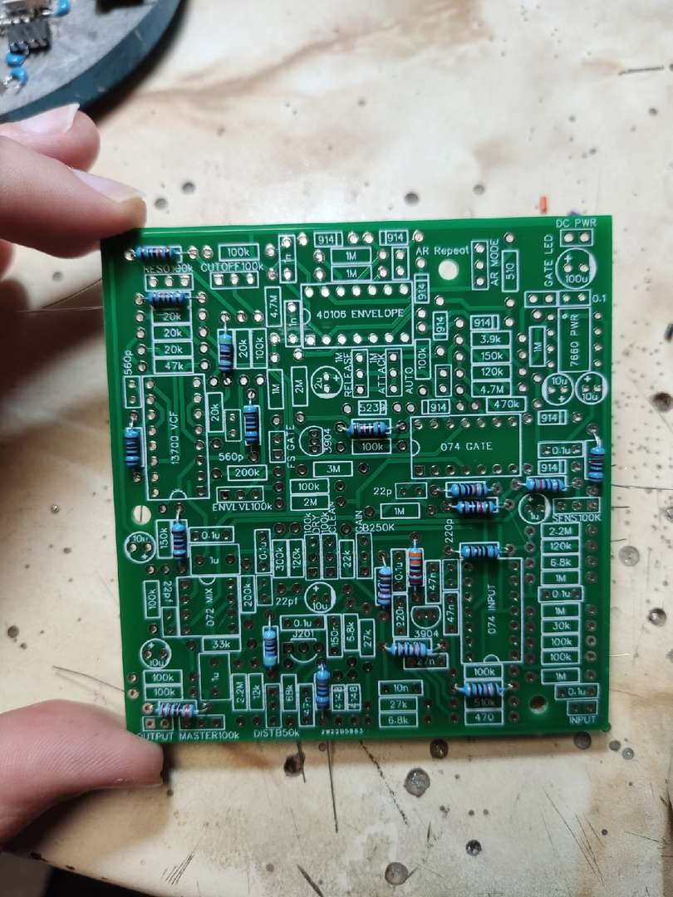

Продолжаем устанавливать резисторы 

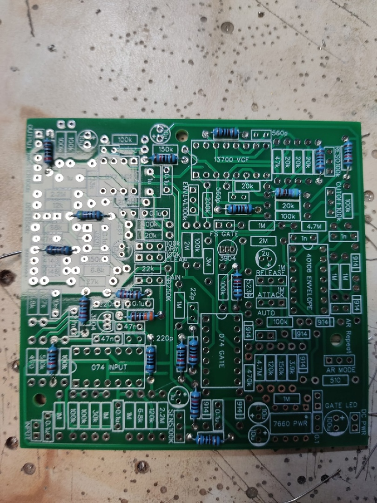

Добавляем диоды 

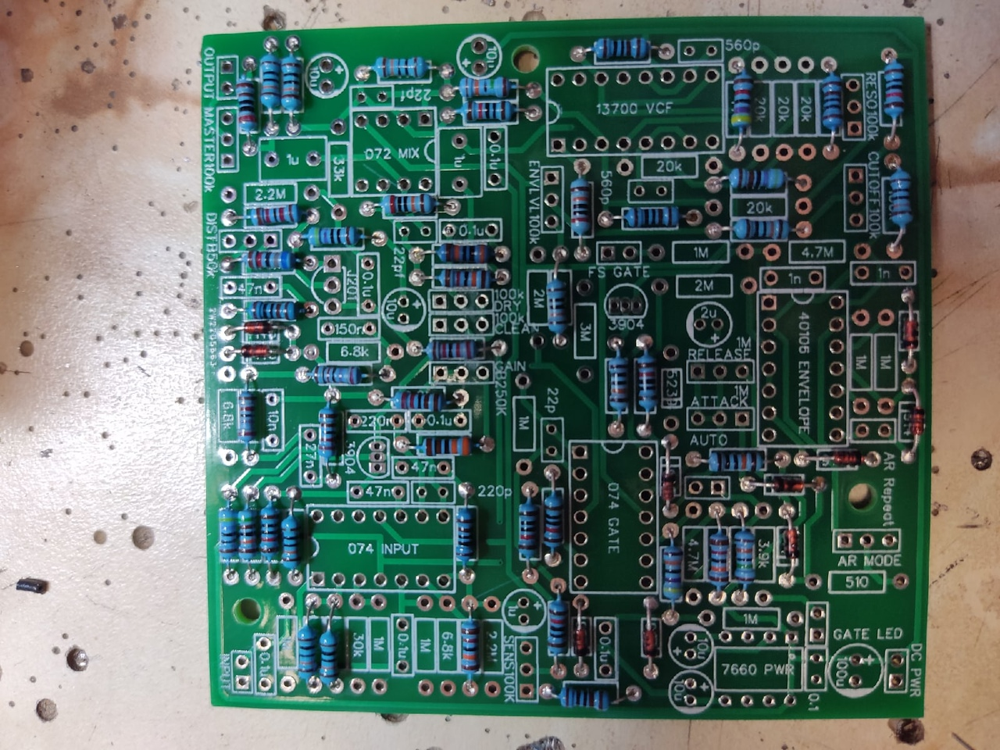

Еще немного резисторов 

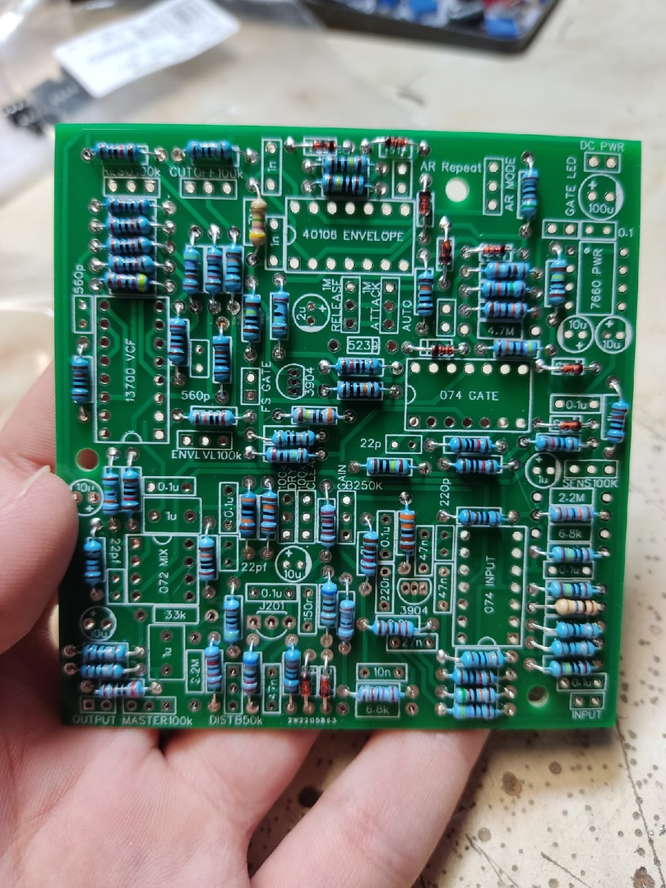

Теперь два транзистора 2n3904, это пожалуй самый сложный этап сборки, так как контакты близко и потребуется некоторая снаровка и жало потоньше 

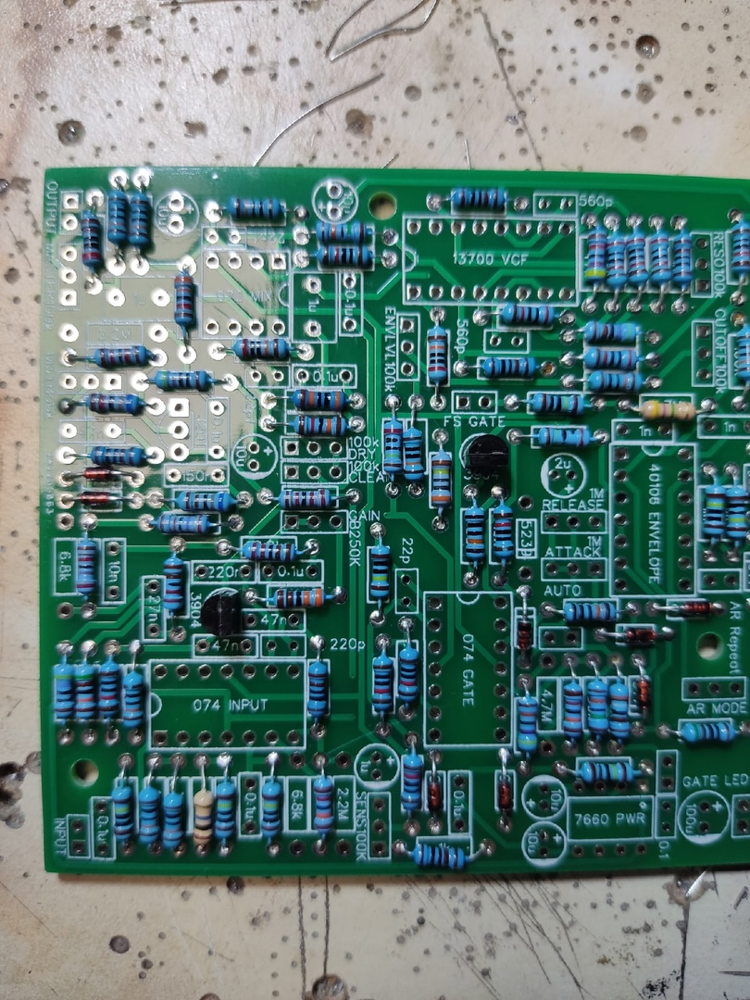

Дальше кроватки для микросхем, впаивать прямо на платы не рекомендую. 
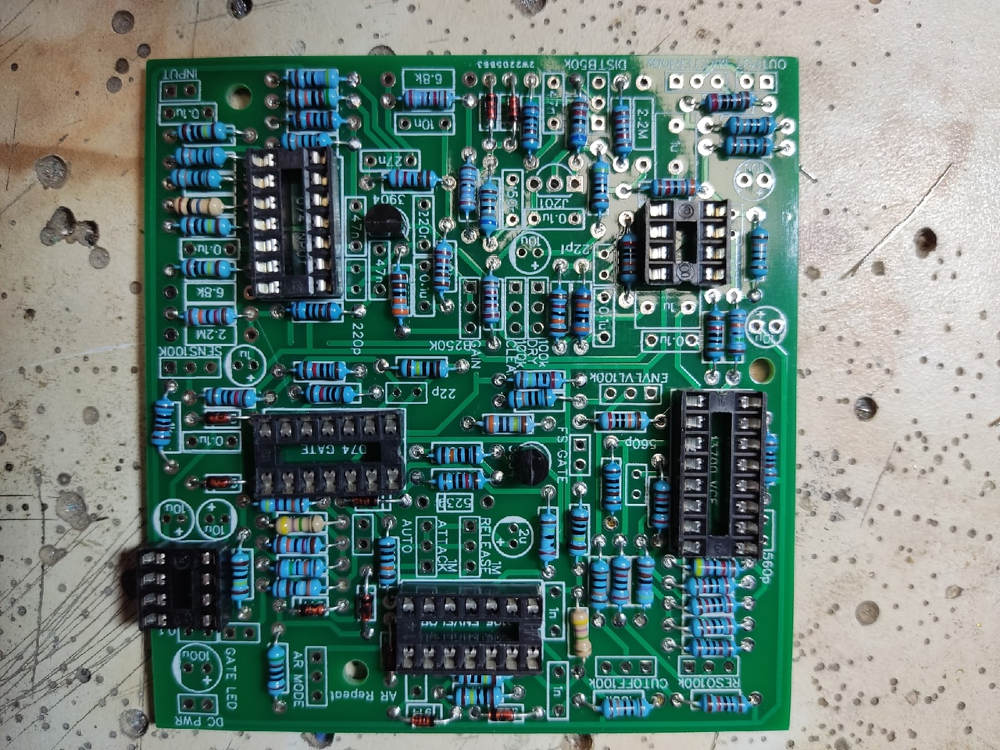

Керамические и пленочные конденсаторы 
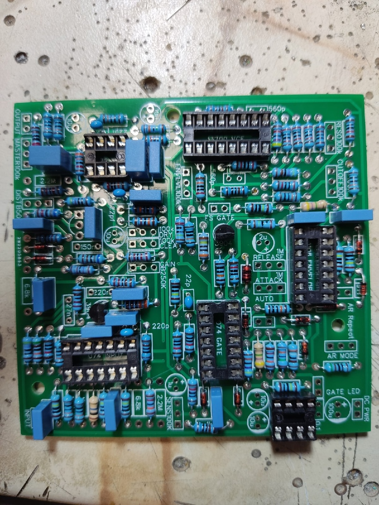

Потом электролиты
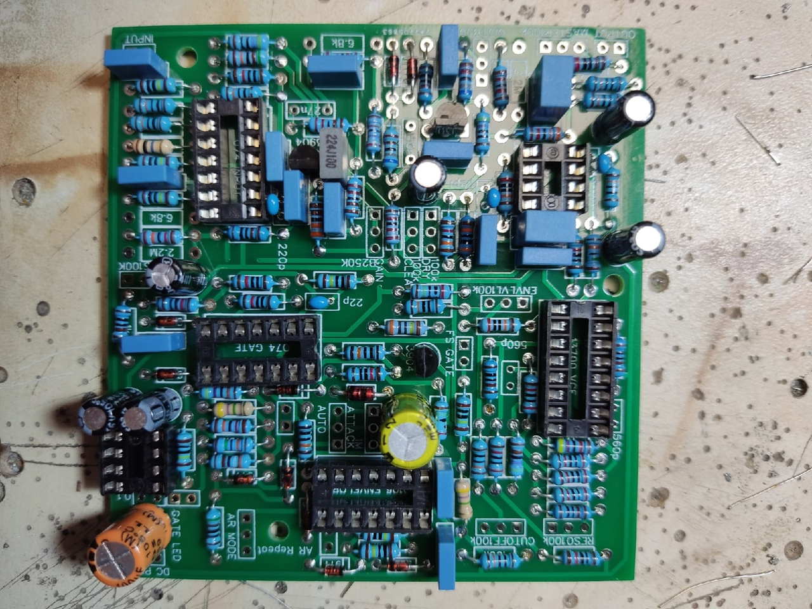 

Еще немного электролитов и то, что осталось 
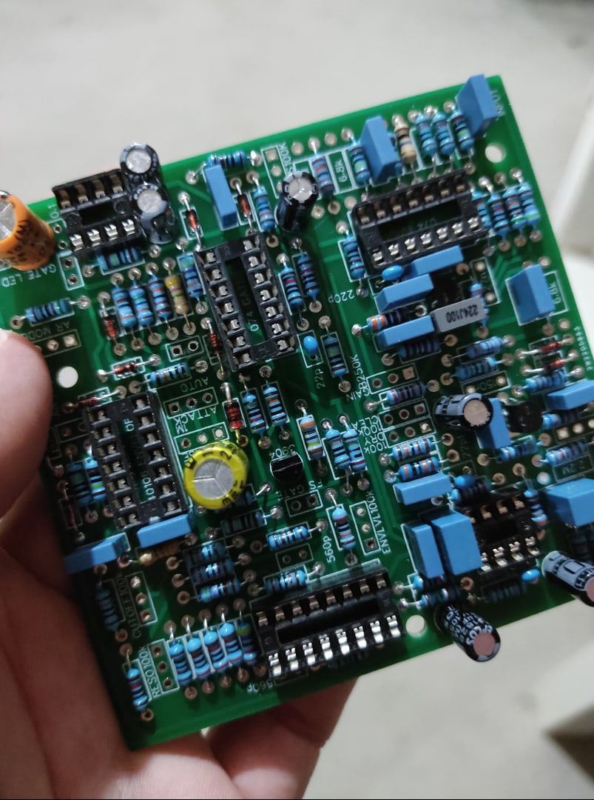

Осталось совсем немного, байпасс конденсаторы с обратной стороны платы, возможно сделать это лучше сразу, но в момент сборки они отсутствовали. 

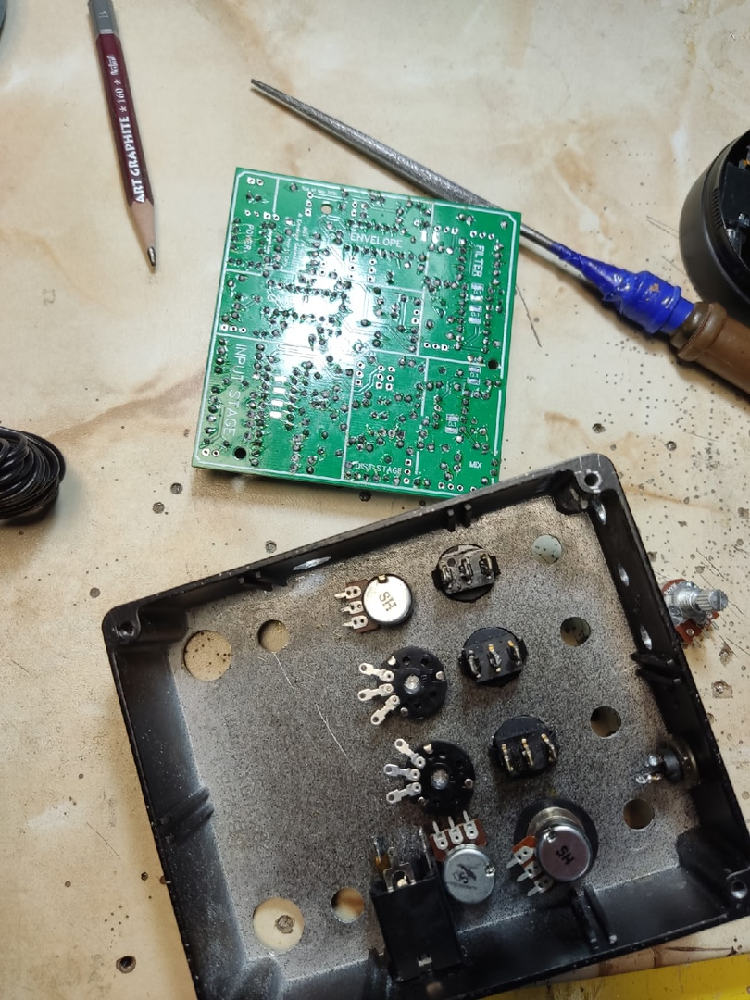

Далее все это дело надо прикинуть как уместится в коробку и сделать отвестия. 
Исходя из расположения ручек на корпусе отмерить провода для потенциометров и сначала припаять к потенциометрам, так будет удобнее удалить лишнюю длину. 

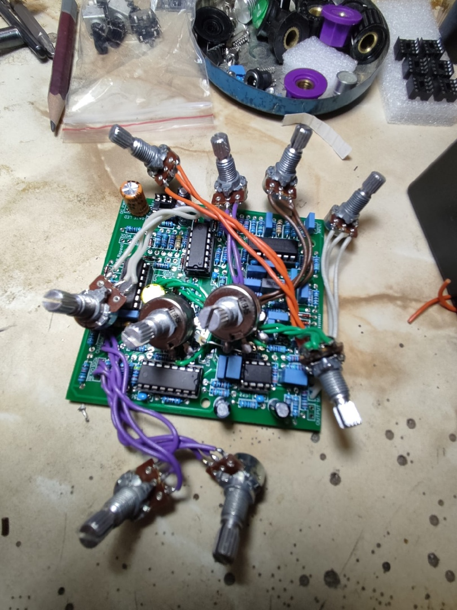

Дальше могу только пожелать удачи аккуратно запихнуть это в корпус и пользоваться! 

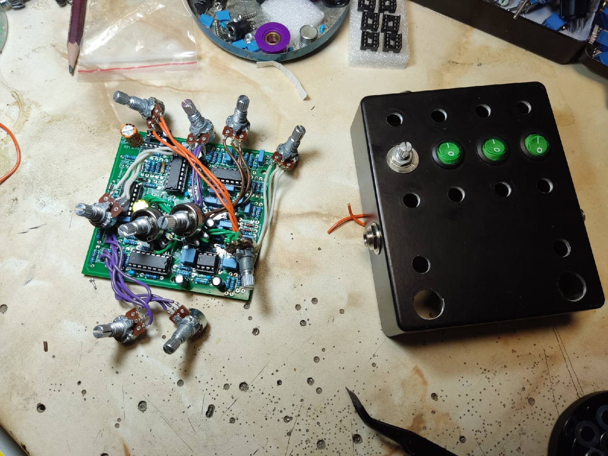

Работает и без байпасс конденсаторов, но конечно желательно их установить. 

